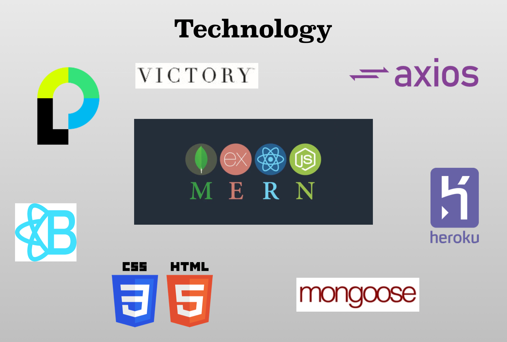

# Abode Organizer

Abode Organizer is a home organization helper tool that helps families keep track of recurring activities or home item purchases that need to be done.


## Getting Started

These instructions will get you a copy of the project up and running on your local machine for development and testing purposes.

### Installation

If you are cloning/downloading the GitHub repo, please be sure to use the package manager [NPM](https://www.npmjs.com/) to install the needed packages for the project to run through node and express:

```bash
NPM dependencies:
    "axios": "^0.18.0",
    "dotenv": "^8.0.0",
    "express": "^4.16.3",
    "if-env": "^1.0.4",
    "moment": "^2.24.0",
    "mongoose": "^5.3.16",
    "morgan": "^1.9.1",
    "react": "^16.6.3",
    "react-bootstrap": "^1.0.0-beta.9",    
    "react-datepicker": "^2.7.0",
    "react-day-picker": "^7.3.0",
    "react-dom": "^16.8.6",
    "react-router-dom": "^4.3.1",
    "react-scripts": "^2.1.1",
    "react-widgets": "^4.4.11",
    "victory": "^32.3.0",
    "victory-area": "^32.3.0"
```
This can be done by running the below code for each dependency

```bash
npm install [program]
```

or you can simply run the below:

```bash
npm i
```

## How to run the program

The application is hosted through heroku and is available at the below link.

https://project-3-vbc.herokuapp.com/

## Project Technical Specs
Abode Organizere is a MERN stack application that is hosted on heroku with a jawsdb database.  The application utilizes passport js and bcrypt to authenticate users.  Additionally, Mongoose models are used to access the jawsdb (mongoDB locally).



## Contributors
Missy Barringer - DB seeding, Routing, Graphic Design
John Westbrooks - Authentication
Rob Suttles - Data Visualizations, React
Brian Storey - React, Front-End Design